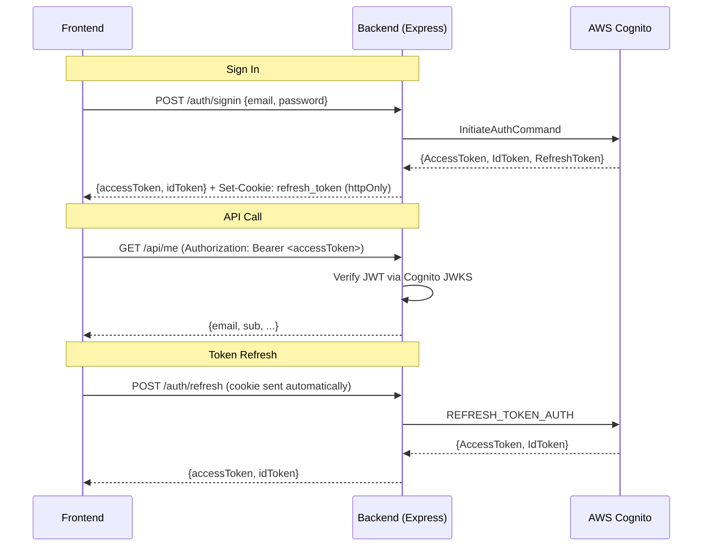

# Phase 3: Backend — Auth Proxy & JWT Middleware

## Goal

Create a Node.js/Express backend that:
1. Proxies authentication through Cognito, storing refresh tokens in HTTP-only cookies
2. Provides JWT verification middleware for protected endpoints
3. Enables automatic, transparent token refresh for the frontend

## Architecture



## Proposed Changes

### Backend Service

#### [NEW] [backend/](file:///Users/brucemartin/code/cognition/backend)

**Tech stack:** Express, TypeScript, `ts-jest`, `jose` (JWT verification), `cookie-parser`

**Structure:**
```
backend/
├── src/
│   ├── index.ts                # Express app entry
│   ├── routes/
│   │   └── auth.ts             # /auth/signin, /auth/refresh, /auth/signout
│   ├── middleware/
│   │   └── verifyJwt.ts        # Cognito JWT verification via JWKS
│   └── routes/
│       └── api.ts              # /api/me (sample protected route)
├── tests/
│   ├── auth.test.ts
│   └── verifyJwt.test.ts
├── package.json
├── tsconfig.json
└── jest.config.ts
```

**Auth routes (`/auth`):**

| Endpoint | Description |
|---|---|
| `POST /auth/signin` | Accepts `{email, password}`, calls Cognito `InitiateAuthCommand`, returns `{accessToken, idToken}` in body, sets `refresh_token` as HTTP-only cookie. Handles MFA challenges. |
| `POST /auth/refresh` | Reads `refresh_token` from cookie, calls Cognito `REFRESH_TOKEN_AUTH`, returns new `{accessToken, idToken}`. |
| `POST /auth/signout` | Clears the HTTP-only cookie. |

**Cookie config:** `httpOnly: true`, `secure: true` (prod), `sameSite: 'strict'`, `path: '/auth'`, `maxAge: 30 days`

**JWT middleware (`verifyJwt`):**
- Fetches Cognito JWKS from `https://cognito-idp.{region}.amazonaws.com/{poolId}/.well-known/jwks.json`
- Caches JWKS keys in memory
- Verifies `Authorization: Bearer <token>` header using `jose` library
- Attaches decoded claims to `req.user`

---

### Frontend Updates

#### [MODIFY] [CognitoService.ts](file:///Users/brucemartin/code/cognition/frontend/src/auth/CognitoService.ts)
- `signIn` → `fetch('/auth/signin')` instead of direct Cognito SDK call
- `respondToAuthChallenge` → `fetch('/auth/signin/mfa')` through backend
- Add `refreshToken()` → `fetch('/auth/refresh')`
- Add `signOut()` → `fetch('/auth/signout')`
- Remove `localStorage` token storage
- Keep `signUp`, `confirmSignUp`, `forgotPassword`, `confirmForgotPassword` as direct SDK calls

#### [NEW] [AuthContext.tsx](file:///Users/brucemartin/code/cognition/frontend/src/auth/AuthContext.tsx)
- React Context: `{accessToken, idToken, isAuthenticated, user, signIn, signOut}`
- Auto-refresh: intercept 401 responses → call `/auth/refresh` → retry original request
- `useAuth()` hook for components

#### [MODIFY] [vite.config.ts](file:///Users/brucemartin/code/cognition/frontend/vite.config.ts)
- Add dev proxy: `/auth` and `/api` → `http://localhost:3001`

---

## Verification Plan

### Automated Tests
- `cd backend && npm test` — auth routes + JWT middleware
- `cd frontend && npm test` — updated CognitoService + AuthContext + existing component tests

### Manual Verification
- Start backend (`npm run dev` on port 3001) and frontend (port 5173)
- Sign in → check cookie in DevTools (Application → Cookies)
- Call `/api/me` → verify JWT verification works
- Wait for token expiry → verify auto-refresh is transparent
